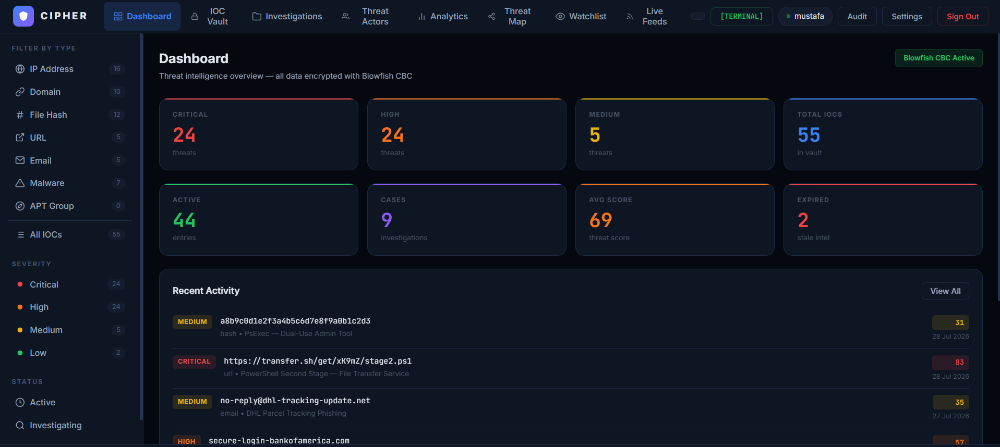
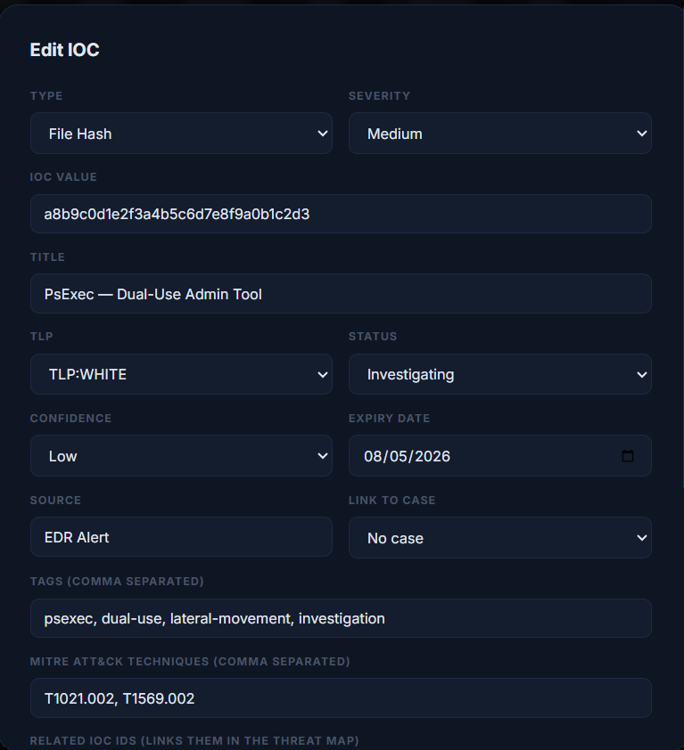
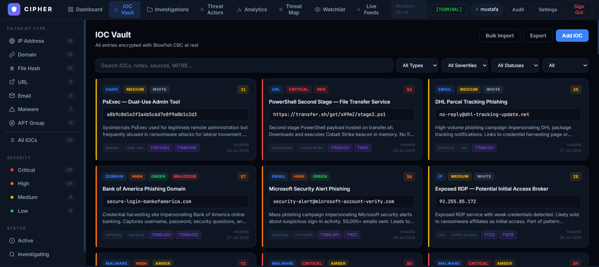
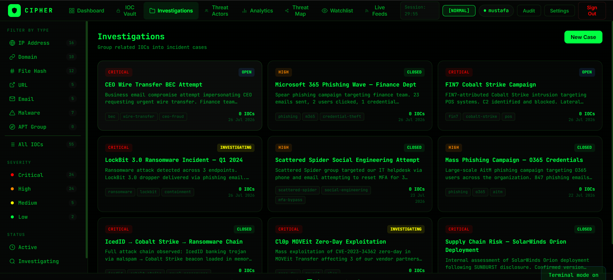

<div align="center">

<br/>

```
  ██████╗██╗██████╗ ██╗  ██╗███████╗██████╗
 ██╔════╝██║██╔══██╗██║  ██║██╔════╝██╔══██╗
 ██║     ██║██████╔╝███████║█████╗  ██████╔╝
 ██║     ██║██╔═══╝ ██╔══██║██╔══╝  ██╔══██╗
 ╚██████╗██║██║     ██║  ██║███████╗██║  ██║
  ╚═════╝╚═╝╚═╝     ╚═╝  ╚═╝╚══════╝╚═╝  ╚═╝
```

**Encrypted Threat Intelligence Platform for SOC Analysts**


</div>

---

## What is CIPHER?

CIPHER is a locally-hosted, fully encrypted threat intelligence platform built for SOC analysts. It gives you a private workspace to store, manage, enrich, and analyze Indicators of Compromise — with every single byte on disk protected by Blowfish CBC encryption implemented from scratch.

No cloud. No subscriptions. No external crypto libraries. Just your data, encrypted, on your machine.

---

## Quick Start

```bash
git clone https://github.com/YOURUSERNAME/CIPHER.git
cd CIPHER
pip install flask
python app.py
```

Open **http://127.0.0.1:5000**

> Default credentials: `mustafa` / `sentinel123`

---

## Features

| | Feature | Description |
|---|---|---|
| 🔒 | **Blowfish CBC Encryption** | Every file on disk encrypted — vault, cases, actors, audit log, notes, watchlist |
| 🔍 | **VirusTotal Integration** | One-click reputation check for IPs, domains, hashes, URLs |
| 🛡 | **AbuseIPDB Integration** | IP abuse confidence score, ISP, country, Tor node detection |
| 📊 | **Threat Scoring** | Auto-calculated 0–100 risk score per IOC based on severity, type, TLP, tags |
| 📁 | **Investigations** | Group IOCs into incident cases with a full living investigation log |
| 📝 | **Investigation Notes** | Time-stamped analyst notes per case — findings, actions, IOCs, TLP notes |
| 👥 | **Threat Actor Profiles** | Full APT database with aliases, tools, MITRE mapping, attribution |
| 📡 | **Live Threat Feeds** | Real-time IOCs from Feodo Tracker and URLhaus — one-click import |
| 👁 | **Watchlist Alerting** | Monitor IOC values — alerts fire when they appear in live feeds |
| 🕸 | **IOC Relationship Map** | D3.js interactive graph of connected threat indicators |
| 📈 | **Analytics** | 30-day timeline, type breakdown, MITRE heatmap, top tags |
| 📤 | **STIX 2.1 Export** | Industry-standard threat intel sharing format |
| 🔄 | **Key Rotation** | Re-encrypt all data with a fresh Blowfish key on demand |
| ⏱ | **Session Timeout** | 30-minute inactivity timeout with live countdown |
| ⬆ | **Bulk Import** | Paste a list of IOCs — imports all at once, skips duplicates |
| ⬛ | **Terminal Mode** | Full green-on-black aesthetic toggle |

---

## Project Structure

```
cipher/
├── app.py                  Entry point — registers blueprints, starts server
├── config.py               All settings in one place
├── requirements.txt
├── .gitignore
│
├── crypto/
│   ├── blowfish.py         Blowfish CBC — implemented from scratch
│   └── vault.py            Encrypt/decrypt helpers, password hashing, scoring
│
├── routes/
│   ├── auth.py             Login, register, logout, session management
│   ├── iocs.py             IOC vault — list, add, edit, delete, bulk import
│   ├── cases.py            Investigation cases + living notes log
│   ├── actors.py           Threat actor profiles
│   ├── intel.py            VirusTotal, AbuseIPDB, STIX export, key rotation
│   ├── analytics.py        Stats, timeline, graph, feeds, watchlist
│   ├── audit.py            Encrypted audit log
│   └── decorators.py       Auth + session timeout decorator
│
├── ui.html                 Full frontend — HTML, CSS, JS in one file
│
└── data/                   All encrypted — never committed to git
    ├── vault.enc
    ├── cases.enc
    ├── actors.enc
    ├── audit.enc
    ├── notes.enc
    ├── watchlist.enc
    └── vault.key
```

---

## Encryption Architecture

All cryptographic components written manually. Zero external crypto libraries.

### Blowfish CBC

```
Plaintext data
      ↓
JSON serialization
      ↓
PKCS7 padding  →  fills last block to 8-byte boundary
      ↓
CBC mode       →  each block XORed with previous ciphertext (kills patterns)
      ↓
16-round Feistel network per 8-byte block
      ↓
F function     →  4 key-dependent S-boxes per round
      ↓
Key schedule   →  subkeys derived from digits of π mixed with your key
      ↓
Ciphertext written to disk
```

Key specs: **256-bit key · 64-bit block · 16 Feistel rounds · CBC mode · PKCS7 padding · random IV per write**

### Authentication

```
Registration  →  random 16-byte salt generated per user
              →  SHA-256(salt + password) stored
              →  password never saved anywhere

Login         →  retrieve stored salt for username
              →  SHA-256(salt + entered password)
              →  compare to stored hash
```

### Key Rotation

```
New 256-bit key generated via OS random
All encrypted files decrypted with old key
All files re-encrypted with new key
Old key overwritten and discarded
```

---

## Threat Scoring

Every IOC gets a 0–100 score calculated from:

| Factor | Max Points |
|---|---|
| Severity (critical/high/medium/low) | 40 |
| IOC type (apt/malware/hash/ip...) | 25 |
| TLP classification (RED/AMBER/GREEN/WHITE) | 18 |
| Active status | 12 |
| Dangerous tags (ransomware, c2, wiper...) | 10 |
| MITRE technique count | 5 |

---

## API Reference

| Method | Endpoint | Description |
|---|---|---|
| POST | `/api/auth/login` | Authenticate |
| POST | `/api/auth/register` | Create account |
| GET | `/api/auth/ping` | Session heartbeat |
| GET | `/api/iocs` | List IOCs with filters |
| POST | `/api/iocs` | Add IOC |
| PUT | `/api/iocs/:id` | Update IOC |
| DELETE | `/api/iocs/:id` | Delete IOC |
| POST | `/api/iocs/bulk` | Bulk import |
| GET | `/api/cases` | List cases |
| POST | `/api/cases` | Create case |
| GET | `/api/cases/:id/notes` | Get case notes |
| POST | `/api/cases/:id/notes` | Add note |
| GET | `/api/actors` | List threat actors |
| POST | `/api/actors` | Add actor |
| POST | `/api/vt` | VirusTotal check |
| POST | `/api/abuseipdb` | AbuseIPDB check |
| GET | `/api/export` | JSON export |
| GET | `/api/export/stix` | STIX 2.1 export |
| GET | `/api/analytics` | Dashboard stats |
| GET | `/api/timeline` | 30-day IOC timeline |
| GET | `/api/graph` | IOC relationship data |
| GET | `/api/feeds` | Pull live threat feeds |
| GET | `/api/watchlist` | Get watchlist |
| POST | `/api/watchlist` | Add to watchlist |
| POST | `/api/watchlist/check` | Check values against watchlist |
| POST | `/api/rotate` | Rotate encryption key |
| GET | `/api/audit` | Audit log |

---

## Optional API Keys

CIPHER works fully offline. These unlock additional enrichment:

| Service | What it adds | Get key |
|---|---|---|
| VirusTotal | Detection counts from 70+ AV engines | virustotal.com (free) |
| AbuseIPDB | IP abuse score, ISP, country, Tor detection | abuseipdb.com (free) |

Add keys in **Settings** after login.

---

## Preloaded Sample Data

Ships with real-world threat intelligence for demonstration:

- **55 IOCs** — LockBit, REvil, Cl0p, DarkSide, Conti, NotPetya, WannaCry, SUNBURST, Industroyer2, Cobalt Strike, IcedID, Brute Ratel, Raccoon Stealer, PlugX, Formbook, BEC campaigns, banking phishing, crypto theft
- **9 Investigation cases** — LockBit ransomware, FIN7 Cobalt Strike, Microsoft phishing, CEO BEC, Cl0p MOVEit zero-day, Scattered Spider, SolarWinds supply chain, IcedID attack chain, O365 AitM
- **33 Investigation notes** — pre-written analyst notes documenting each case timeline
- **10 Threat actor profiles** — APT29, Lazarus, FIN7, Sandworm, Scattered Spider, APT41, Turla, Cl0p, Kimsuky, REvil

---
## Screenshots






## Easter Egg

There is one hidden in the UI. Lemme see if u can Find it.

---

## Built By

<div align="center">

**Mustafa Gomaa**


[](https://www.linkedin.com/in/lumidren/)
[](https://tryhackme.com/p/MustafaGomaa)

*CIPHER — because your threat intelligence deserves better than plaintext.*

</div>
